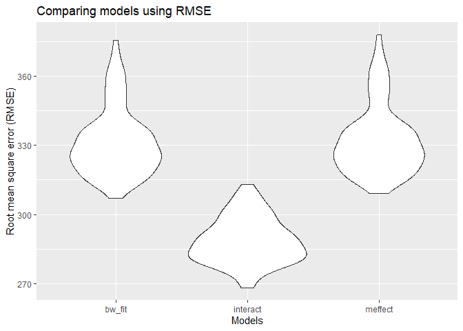

p8105\_hw6\_sz2800
================
Stephanie Zhen
11/25/2019

``` r
library(tidyverse)
```

    ## -- Attaching packages ------------------------------------------- tidyverse 1.2.1 --

    ## v ggplot2 3.2.1     v purrr   0.3.2
    ## v tibble  2.1.3     v dplyr   0.8.3
    ## v tidyr   1.0.0     v stringr 1.4.0
    ## v readr   1.3.1     v forcats 0.4.0

    ## -- Conflicts ---------------------------------------------- tidyverse_conflicts() --
    ## x dplyr::filter() masks stats::filter()
    ## x dplyr::lag()    masks stats::lag()

``` r
library(modelr)
library(purrr)
```

## Q1: Baby’s birthweight

Cleaning data.

``` r
hw6_bw = read.csv("./data/birthweight.csv")

bw_clean = hw6_bw %>% 
  janitor::clean_names() %>% 
  mutate(babysex = ifelse(babysex == 1, "male", "female"),
        babysex = as.factor(babysex)) %>% 
  mutate(frace = as.factor(frace),
         frace = recode_factor(frace, '1' = "white", '2' = "black", '3' = "asian", '4' = "puerto rican", '8' = "other", '9' = "unknown")) %>% 
  mutate(malform = ifelse(malform == 0, "absent", "present"),
         malform = as.factor(malform)) %>% 
  mutate(mrace = as.factor(mrace),
         mrace = recode_factor(mrace, '1' = "white", '2' = "black", '3' = "asian", '4' = "puerto rican", '8' = "other"))


summary(bw_clean)
```

    ##    babysex         bhead          blength           bwt      
    ##  female:2112   Min.   :21.00   Min.   :20.00   Min.   : 595  
    ##  male  :2230   1st Qu.:33.00   1st Qu.:48.00   1st Qu.:2807  
    ##                Median :34.00   Median :50.00   Median :3132  
    ##                Mean   :33.65   Mean   :49.75   Mean   :3114  
    ##                3rd Qu.:35.00   3rd Qu.:51.00   3rd Qu.:3459  
    ##                Max.   :41.00   Max.   :63.00   Max.   :4791  
    ##      delwt          fincome               frace         gaweeks     
    ##  Min.   : 86.0   Min.   : 0.00   white       :2123   Min.   :17.70  
    ##  1st Qu.:131.0   1st Qu.:25.00   black       :1911   1st Qu.:38.30  
    ##  Median :143.0   Median :35.00   asian       :  46   Median :39.90  
    ##  Mean   :145.6   Mean   :44.11   puerto rican: 248   Mean   :39.43  
    ##  3rd Qu.:157.0   3rd Qu.:65.00   other       :  14   3rd Qu.:41.10  
    ##  Max.   :334.0   Max.   :96.00                       Max.   :51.30  
    ##     malform        menarche        mheight          momage    
    ##  absent :4327   Min.   : 0.00   Min.   :48.00   Min.   :12.0  
    ##  present:  15   1st Qu.:12.00   1st Qu.:62.00   1st Qu.:18.0  
    ##                 Median :12.00   Median :63.00   Median :20.0  
    ##                 Mean   :12.51   Mean   :63.49   Mean   :20.3  
    ##                 3rd Qu.:13.00   3rd Qu.:65.00   3rd Qu.:22.0  
    ##                 Max.   :19.00   Max.   :77.00   Max.   :44.0  
    ##           mrace          parity            pnumlbw     pnumsga 
    ##  white       :2147   Min.   :0.000000   Min.   :0   Min.   :0  
    ##  black       :1909   1st Qu.:0.000000   1st Qu.:0   1st Qu.:0  
    ##  asian       :  43   Median :0.000000   Median :0   Median :0  
    ##  puerto rican: 243   Mean   :0.002303   Mean   :0   Mean   :0  
    ##                      3rd Qu.:0.000000   3rd Qu.:0   3rd Qu.:0  
    ##                      Max.   :6.000000   Max.   :0   Max.   :0  
    ##      ppbmi            ppwt           smoken           wtgain      
    ##  Min.   :13.07   Min.   : 70.0   Min.   : 0.000   Min.   :-46.00  
    ##  1st Qu.:19.53   1st Qu.:110.0   1st Qu.: 0.000   1st Qu.: 15.00  
    ##  Median :21.03   Median :120.0   Median : 0.000   Median : 22.00  
    ##  Mean   :21.57   Mean   :123.5   Mean   : 4.145   Mean   : 22.08  
    ##  3rd Qu.:22.91   3rd Qu.:134.0   3rd Qu.: 5.000   3rd Qu.: 28.00  
    ##  Max.   :46.10   Max.   :287.0   Max.   :60.000   Max.   : 89.00

Recoded the baby’s sex, father’s race, mother’s race, and malform into
factor variables and appropriate labels. There doesn’t seem to have any
NA’s in this dataset.

Model building for outcome birthweights

``` r
bw_fit = lm(bwt ~ babysex + ppbmi + gaweeks + smoken + blength, data = bw_clean) 
bw_fit %>% 
  broom::tidy() %>% 
  select(term, estimate, p.value)
```

    ## # A tibble: 6 x 3
    ##   term        estimate  p.value
    ##   <chr>          <dbl>    <dbl>
    ## 1 (Intercept) -4426.   0.      
    ## 2 babysexmale    20.3  4.55e- 2
    ## 3 ppbmi           6.35 6.41e- 5
    ## 4 gaweeks        27.7  1.02e-56
    ## 5 smoken         -2.65 1.07e- 4
    ## 6 blength       127.   0.

``` r
bw_fit
```

    ## 
    ## Call:
    ## lm(formula = bwt ~ babysex + ppbmi + gaweeks + smoken + blength, 
    ##     data = bw_clean)
    ## 
    ## Coefficients:
    ## (Intercept)  babysexmale        ppbmi      gaweeks       smoken  
    ##   -4425.664       20.335        6.354       27.684       -2.652  
    ##     blength  
    ##     126.875

Inital online research shows that mother’s BMI, gender of baby, length
of pregnancy, and mother’s lifestyle, length of baby are known factors
that can influence the birthweight of the baby. Therefore, for the model
buliding, I use the variables, babysex, ppbmi, gaweeks, smoken, blength
as predictors for the outcome, birthweight, bwt. Since birthweight is a
continuous outcome, I will use linear regression.

Prediction and residual plot

``` r
bw_resid = bw_clean %>% 
  modelr::add_residuals(bw_fit)

bw_pred = bw_clean %>% 
  modelr::add_predictions(bw_fit) %>% 
  select(pred)

bw_resid_pred = cbind(bw_resid, bw_pred)

bw_pred_resid_plot = ggplot(bw_resid_pred, aes(x = pred, y = resid)) +
  geom_point()

bw_pred_resid_plot
```

<!-- -->

Model 2: using length at birth and gestational age as predictors (main
effects only):

``` r
bw_meffect = lm(bwt ~ gaweeks + blength, data = bw_clean) 
bw_meffect %>% 
  broom::tidy() %>% 
  select(term, estimate, p.value)
```

    ## # A tibble: 3 x 3
    ##   term        estimate  p.value
    ##   <chr>          <dbl>    <dbl>
    ## 1 (Intercept)  -4348.  0.      
    ## 2 gaweeks         27.0 2.36e-54
    ## 3 blength        129.  0.

``` r
bw_meffect
```

    ## 
    ## Call:
    ## lm(formula = bwt ~ gaweeks + blength, data = bw_clean)
    ## 
    ## Coefficients:
    ## (Intercept)      gaweeks      blength  
    ##    -4347.67        27.05       128.56

Model 3: using head circumference, length, sex, and all interactions
(including the three-way interaction).

``` r
bw_interact = lm(bwt ~ bhead + blength + babysex + (bhead * blength) + (bhead * babysex) + (blength * babysex) + (bhead * blength * babysex), data = bw_clean) 
bw_interact %>% 
  broom::tidy() %>% 
  select(term, estimate, p.value)
```

    ## # A tibble: 8 x 3
    ##   term                      estimate    p.value
    ##   <chr>                        <dbl>      <dbl>
    ## 1 (Intercept)                -802.   0.467     
    ## 2 bhead                       -16.6  0.626     
    ## 3 blength                     -21.6  0.354     
    ## 4 babysexmale               -6375.   0.000147  
    ## 5 bhead:blength                 3.32 0.00000317
    ## 6 bhead:babysexmale           198.   0.000105  
    ## 7 blength:babysexmale         124.   0.000429  
    ## 8 bhead:blength:babysexmale    -3.88 0.000245

``` r
bw_interact
```

    ## 
    ## Call:
    ## lm(formula = bwt ~ bhead + blength + babysex + (bhead * blength) + 
    ##     (bhead * babysex) + (blength * babysex) + (bhead * blength * 
    ##     babysex), data = bw_clean)
    ## 
    ## Coefficients:
    ##               (Intercept)                      bhead  
    ##                  -801.949                    -16.598  
    ##                   blength                babysexmale  
    ##                   -21.646                  -6374.868  
    ##             bhead:blength          bhead:babysexmale  
    ##                     3.324                    198.393  
    ##       blength:babysexmale  bhead:blength:babysexmale  
    ##                   123.773                     -3.878

In order to correctly define a three way interaction, I must also
include all the two way interaction terms and main effects as well.

Comparing my model with the model with just the main effects and model
with the three way interaction.

``` r
bw_cv = 
  crossv_mc(bw_clean, 100) 

bw_cv =
  bw_cv %>% 
  mutate(
    train = map(train, as_tibble),
    test = map(test, as_tibble))

bw_cv = bw_cv %>% 
  mutate(
    bw_fit = map(train, ~lm(bwt ~ babysex + ppbmi + gaweeks + smoken + blength, data = .x)),
    bw_meffect = map(train, ~lm(bwt ~ gaweeks + blength, data = .x)),
    bw_interact = map(train, ~lm(bwt ~ bhead + blength + babysex + (bhead * blength) + (bhead * babysex) + (blength * babysex) + (bhead * blength * babysex), data = .x))) %>% 
  mutate(
    rmse_bw_fit = map2_dbl(bw_fit, test, ~rmse(model = .x, data = .y)),
    rmse_meffect = map2_dbl(bw_meffect, test, ~rmse(model = .x, data = .y)),
    rmse_interact = map2_dbl(bw_interact, test, ~rmse(model = .x, data = .y))
  )
```

Prepping for graphing root mean square error and plotting it

``` r
bw_cv_pre = bw_cv %>% 
  select(starts_with("rmse")) %>% 
  pivot_longer(
    everything(),
    names_to = "model",
    values_to = "rmse",
    names_prefix = "rmse_")


bw_cv_plot = 
  ggplot(bw_cv_pre, aes(x = model, y = rmse)) + 
  geom_violin()


bw_cv_plot
```

<!-- -->

The model with the 3 way interaction term has the lowest root mean
square error and thus seems to be the model that predicts birthweight
best. However, it is also the model with the most variables and is not
parsimonious. My model has 5 variables and has similar root mean square
error with the model that has only the main effect (2 variables).
Therefore, the most parsimonious model is the model with only the main
effects, and the model with the lowest root mean square error is the
model with the three way interaction.

## Question 2:

``` r
set.seed(1)

weather_df = 
  rnoaa::meteo_pull_monitors(
    c("USW00094728"),
    var = c("PRCP", "TMIN", "TMAX"), 
    date_min = "2017-01-01",
    date_max = "2017-12-31") %>%
  mutate(
    name = recode(id, USW00094728 = "CentralPark_NY"),
    tmin = tmin / 10,
    tmax = tmax / 10) %>%
  select(name, id, everything())
```

    ## Registered S3 method overwritten by 'crul':
    ##   method                 from
    ##   as.character.form_file httr

    ## Registered S3 method overwritten by 'hoardr':
    ##   method           from
    ##   print.cache_info httr

    ## file path:          C:\Users\Stephanie\AppData\Local\rnoaa\rnoaa\Cache/ghcnd/USW00094728.dly

    ## file last updated:  2019-09-26 10:26:37

    ## file min/max dates: 1869-01-01 / 2019-09-30

Linear model with tmin as predictor and tmax as response

``` r
weather_mod = lm(tmax ~ tmin, data = weather_df) %>% 
  broom::glance()

boot_sample = function(df) {
  sample_frac(df, replace = TRUE)
}
```

Wrangling data to plot log(beta0 \* beta1) estimates

``` r
log_beta_pre = weather_df %>% 
  modelr::bootstrap(n = 1000) %>% 
  mutate(
    models = map(strap, ~lm(tmax ~ tmin, data = .x)),
    results = map(models, broom::tidy)) %>% 
  select(-strap, -models) %>% 
  unnest(results) %>% 
  select(-std.error, -statistic, -p.value) %>% 
  pivot_wider(
    names_from = term,
    values_from = estimate) %>% 
  janitor::clean_names() %>% 
  mutate(log_bvalue = log(intercept * tmin))

log_beta_plot = log_beta_pre %>% 
  ggplot(aes(x = log_bvalue)) +
  geom_density()

log_beta_plot
```

<!-- -->

``` r
log_beta_int = log_beta_pre %>% 
  pull(log_bvalue) %>% 
  quantile(., probs = c(0.025, 0.975, 0.95), na.rm = TRUE)

log_beta_int
```

    ##     2.5%    97.5%      95% 
    ## 1.965042 2.059435 2.051695

R^2 95% confidence interval and denisty plot.

``` r
r2_pre = weather_df %>% 
  modelr::bootstrap(n = 1000) %>% 
  mutate(
    models = map(strap, ~lm(tmax ~ tmin, data = .x)),
    results = map(models, broom::glance)) %>% 
  select(-strap, -models) %>% 
  unnest(results) %>% 
  janitor::clean_names()

r2_plot = r2_pre %>% 
  ggplot(aes(x = r_squared)) +
  geom_density()

r2_plot
```

<!-- -->

``` r
r2_int = r2_pre %>% 
  pull(r_squared) %>% 
  quantile(., probs = c(0.025, 0.975, 0.95), na.rm = TRUE)

r2_int
```

    ##      2.5%     97.5%       95% 
    ## 0.8948613 0.9270905 0.9253317
